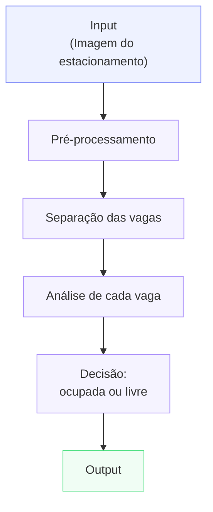

# Proposta do Projeto

## Problema
Esse  projeto investiga a identificação automática de vagas livres e ocupadas em estacionamentos a partir de imagens obtidas por câmeras fixas, utilizando técnicas clássicas de Processamento Digital de Imagens.

A situação inicial considerada é a existência de imagens de um mesmo estacionamento capturadas ao longo do temo, com enquadramento fixo e com as regiões correxspondentes às vagas previamente conhecidas. A partir dessas imagens, pretende-se analisar individualmente cada vaga e determinar se ela se encontra livre ou ocupada.

O problema envolve diretamente processamento e análise de imagens, pois a decisão sobre o estado da vaga será obtida a partir da comparação visual entre uma imagem atual e uma imagem de referência da mesma região em estado livre.

Entre os fatores que podem dificultar essa comparação estão:
* variações de iluminação;
* presença de sombras;
* mudanças nas condições climáticas;
* reflexos;
* diferenças de intensidade de pixels;
* veículos com cores similares às do ambientes;
* pequenas alterações visuais entre diferentes momentos de captura.

A proposta inicial consiste em investigar se técnicas como pré-processamento, diferenteças absolutas entre imagens, limiarização e operações morfológicas são suficientes para identificar alterações significativas nas regiões correspondentes às vagas.

A principal questão investiga pelo projeto é:

Como identificar vagas livres e ocupadas em imagens de estacionamentos utilizandos técnicas clássicas de Processamento Digital de Imagens baseadas na comparação entre imagens, considerando variações de iluminação, sombras e condições ambientais?

A partir das classificações individuais, também deverá ser possível obter informações gerais sobre o eestacionamento, como:
* quantidade total de vagas analisadas;
* quantidade de vagas livres;
* quantidade de vagas ocupadas;
* percentual de ocupação do estacionamento.

O projeto será incialmente delimitado a imagens obtidas por câmeras ficas e a vagas cujas regiões já estejam previamente identificadas. Dessa forma, a primeira etapa do projeto não terá como objetivo determinar automaticamente a localização das vagas, mas analisar o estado de ocupação das regiões conhecidas.

## Contexto de Aplicação
Estacionamentos com grande quantidade de vagas podem apresentar dificuldades para que motoristas identifiquem rapidamente a disponibilidade de espaços livres.

Uma possível abordagem para obter essas informações é a instalação de sensores físicos individuais em cada vaga. Entretanto, outra possibiliade consiste em utilizar imagens provenientes de câmeras já posicionadas no estacionamento e realizar o processamento dessas imagens para estimar sua ocupação.

Nesse contexto, uma solução baseda em Processamento Digital de Imagens poderia utilizar imagens capturadas periodicamente para determinar o estado da vagas e produzir informações sobre a disponibilidade do estacionamento.

Uma possível aplicação seria um sistema de monitoramente capaz de produzir informações como:

Total de vagas: 40
Vagas ocupadas: 27
Vagas livres: 13

Taxa de ocupação: 67,5%

Essas vagas poderiam posteriormente ser utilizadas em:
* painéis de monitoramento;
* sistemas de orientação aos motoristas;
* acompanhamento da utilização do estacionamento;
* análise histórica de ocupação;
* identificação de horários com maior ou menor utilização.

Neste projeto, entretanto, o foco não está no desenvolvimento de um sistema comercial completo. O principal objetivo é investigar a viabilidade de técnicas clássicas de PDI para extrair informações sobre a ocupação diretamente das imagens.

Para realizar os experimentos será utilizado o dataset PKLot, disponibilizado por meio da plataforma Hugging Face:

[Hugging Face](https://huggingface.co/datasets/Voxel51/PKLot)

O conjunto possui imagens de estacionamentos capturas por câmeras fixas e apresenta diferentes situações de ocupação e condições ambientais.

Inicialmente, será selecionado um subconjunto de imagens provenientes do mesmo estacionamento e da mesma câmera, de forma a manter o enquadramento constante e facilitar os experimentos de comparação entre imagens.

Posteriormente, o projeto poderá ser ampliado para avaliar o compotamento da abordagem diante de diferentes condições climáticas e de iluminação.

## Objetivo

### Objetivo Geral

Desenvolver uma abordagem computacional com técnicas clássicas de Processamento de Imagens Digitais para identificar automaticamente a ocupação de vagas de estacionamento a partir de imagens obtidas por câmeras fixas.

### Objetivos Específicos

- Selecionar e organizar um conjunto inicial de imagens.
- Investigar técnicas clássicas de processamento de imagens que possam ser utilizadas no pré-processamento e na comparação entre as imagens.
- Desenvolver uma estratégia de classificação das regiões analisadas em vagas livres e ocupadas.
- Avaliar a viabilidade da proposta por meio de experimentos com diferentes imagens do conjunto selecionado.
- Determinar, a partir da classificação das vagas, informações sobre a ocupação do estacionamento, como quantidade de vagas livres, quantidade de vagas ocupadas e percentual de ocupação.

## Entrada e saída esperadas

### Input
- Finalidade: Fornecer as imagens de estacionamento a serem analisadas no pipeline;
- Técnicas consideradas: N/A;
- Informação recebida: Imagens do dataset;
- Informação produzida: Imagens selecionadas para o envio ao pré-processamento;
- Principais dúvidas: Qual conjunto de imagens utilizar entre os três disponíveis, ou utilizar dos três.

### Pré-processamento
- Finalidade: Preparar, normalizar e padronizar as imagens para facilitar etapas seguintes;
- Técnicas consideradas: ??;
- Informação recebida: Imagens de estacionamento a serem pré-processadas;
- Informação produzida: Imagens pré-processadas?;
- Principais dúvidas: Quais técnicas de pré-processamento seram as mais adequadas.

### Separação das vagas
- Finalidade: Identificar e delimitar a área de cada vaga de estacionamento, determinando seus limites para que possam ser analisadas individualmente;
- Técnicas consideradas: Delimitação manual das vagas, detecção de linhas e bordas, análise de contornos e transformada de Hough;
- Informação recebida: imagens pré-processadas do estacionamento;
- Informação produzida: Imagens e metadados de vagas já delimitadas em suas extremidades;
- Principais dúvidas: Quais técnias de delimitação de espaço utilizar para medir e separar as vagas.

### Análise de cada vaga
- Finalidade: Analisar individualmente cada região de vaga e identificar alterações visuais que possam indicar a presença de um veículo;
- Técnicas consideradas: Comparação com imagem de referência da vaga livre, diferença absoluta entre imagens, análise de intensidade, limiarização, cálculo da proporção dos pixels alterados e operações morfológicas como abertura e fechamento;
- Informação recebida: Imagem da vaga delimitada e imagem de referência da mesma vaga em estado livre;
- Informação produzida: Máscara ou medida quantitativa representando o nível de alteração existente na região da vaga.
- Principais dúvidas: Qual técnica de comparação apresenta melhor resultado, qual valor de limiar utilizar para considerar um pixel como significativamente alterado e como reduzir alterações procadas por sombras, iluminação, chuva ou outros fatores externos.

### Decisão
- Finalidade: Determinar se cada vaga analisada deve ser classificada como livre ou ocupada a partir das informações extraídas na etapa anterior;
- Técnicas consideradas: Definição de limiar basedo na porporção de pixels alterados, análise da área modificada e comparação experimental com os estado reais informados pelo dataset;
- Informação recebida: Medidas ou máscaras representando o nível de alteração observado em cada vaga;
- Informação produzida: Classificação individual de cada vaga como livre ou ocupada;
- Principais dúvidas: Qual valor de limiar de ocupação apresenta melhor separação entre vagas livres e ocupadas e se esse valor poderá ser utilizado em diferentes condições de iluminação, clima e estacionamento.

### Output
- Finalidade: Apresentar de forma clara os resultados obtidos pelo processamento das imagens e fornecer informações sobre a ocupação geral do estacionamento;
- Técnicas consideradas: Geração de imagem com marcações sobre as vagas, contagem dos estados detectados e cálculo da taxa percentual de ocupação.
- Informação recebida: Classificação individual das vagas como livres ou ocupadas;
- Informação produzida: Imagem com identificação visual das vagas, quantidade de vagas livres e ocupadas e taxa estimada de ocupação do estacionamento;
- Principais dúvidas: Qual forma de apresentação permitirá interpretar melhor os resultados e quais informações deverão ser exibidas para facilitar a avaliação do desempenho do método.