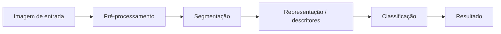
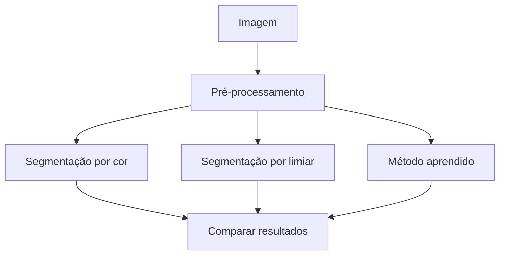

# Projeto Aplicado Longitudinal — Etapa M1

## 1. Objetivo da etapa

O projeto aplicado será desenvolvido progressivamente durante a disciplina de Processamento de Imagens.

Na **M1**, o objetivo principal não é entregar uma solução pronta. Espero que vocês consigam **definir um problema pertinente de Processamento Digital de Imagens (PDI), delimitar seu escopo, investigar sua viabilidade e planejar tecnicamente uma solução que possa evoluir durante a M2 e a M3**.

Nesta etapa, portanto, será mais importante demonstrar que o grupo:

- compreendeu o problema que pretende investigar;
- possui imagens adequadas para trabalhar;
- consegue explicar quais informações pretende obter dessas imagens;
- consegue propor um fluxo de processamento coerente;
- identificou métodos que poderão ser estudados e experimentados;
- organizou o projeto de maneira que ele possa evoluir durante o semestre;
- consegue justificar tecnicamente suas principais decisões.

O projeto deverá permanecer **o mesmo projeto longitudinal** durante M1, M2 e M3, embora alterações de escopo, métodos e estratégias sejam esperadas conforme o grupo desenvolva conhecimento e obtenha resultados.

---

# 2. Liberdade tecnológica

Não será imposta uma linguagem de programação específica.

Também **não será fornecido um projeto-base obrigatório**.

O grupo poderá escolher linguagens, bibliotecas, frameworks e ferramentas adequados ao problema proposto.

Exemplos possíveis incluem, sem limitar o trabalho a eles:

- C++ e OpenCV;
- Python e OpenCV;
- Python e scikit-image;
- Python e scikit-learn;
- bibliotecas de aprendizado de máquina;
- ferramentas específicas de visão computacional;
- outras combinações tecnicamente justificadas.

A liberdade tecnológica não elimina a necessidade de organização, documentação e reprodutibilidade.

A escolha das tecnologias deverá ser **compatível com o problema e justificada pelo grupo**.

---

# 3. Código na M1

**Não é obrigatória a entrega de uma implementação funcional na M1.**

Um grupo poderá concluir esta etapa ainda concentrado na definição do problema, obtenção das imagens, investigação dos métodos, desenho do pipeline e realização de experimentos preliminares.

Entretanto, qualquer código, notebook, script ou protótipo que já tenha sido produzido deverá ser incluído no repositório.

Código existente será considerado uma evidência adicional de investigação e viabilidade, mas **a simples existência de código não garantirá uma avaliação melhor**.

Um projeto conceitualmente bem delimitado, tecnicamente fundamentado e cuidadosamente documentado poderá ser mais adequado à M1 do que uma implementação extensa sem clareza sobre o problema que está sendo resolvido.

---

# 4. Repositório público obrigatório

Cada grupo deverá manter um **repositório online público** para o projeto.

Recomendo preferencialmente o **GitHub**, embora outra plataforma baseada em Git possa ser utilizada quando houver justificativa.

O repositório será utilizado durante todo o desenvolvimento do projeto e deverá permanecer **público inclusive durante seu desenvolvimento**.

Não considero o repositório apenas um local para depositar arquivos no momento da entrega. Ele deverá funcionar como registro da evolução do projeto.

Assim, espero encontrar um histórico minimamente coerente de alterações e commits ao longo do período de trabalho.

---

# 5. Estrutura mínima do repositório na M1

Como não existe uma linguagem obrigatória, não vou impor uma árvore rígida de projeto.

Entretanto, o repositório deverá possuir uma organização mínima equivalente à exigida nos laboratórios individuais.

Uma estrutura possível é:

```text
nome-do-projeto/
├── README.md
├── docs/
│   └── proposta.md
├── images/
│   ├── input/
│   └── results/
├── src/                 # quando já houver código
├── notebooks/           # quando aplicável
├── tests/               # quando aplicável
├── LICENSE              # quando aplicável
└── .gitignore
```

Essa estrutura é apenas uma referência.

O grupo poderá adaptá-la de acordo com a linguagem, as ferramentas e a natureza do projeto, desde que os arquivos permaneçam organizados e seja possível compreender sua finalidade.

Pastas vazias não precisam ser criadas apenas para reproduzir esta estrutura.

---

# 6. README obrigatório

O arquivo `README.md` deverá ser a porta de entrada do projeto.

Ao acessar o repositório, uma pessoa que não participou das discussões do grupo deverá conseguir compreender, pelo menos:

1. título do projeto;
2. integrantes;
3. problema investigado;
4. contexto de aplicação;
5. objetivo geral;
6. visão resumida da solução proposta;
7. conjunto ou origem das imagens;
8. estágio atual do projeto;
9. organização do repositório;
10. tecnologias previstas ou já utilizadas;
11. instruções para reproduzir experimentos existentes, quando houver;
12. link para o vídeo da M1;
13. link para documentação adicional existente no próprio repositório.

Não transformem o README em apenas uma lista de links.

Ele deverá funcionar como uma **síntese técnica navegável do projeto**.

---

# 7. Documento de proposta

O repositório deverá conter pelo menos um documento Markdown com a proposta detalhada, por exemplo:

```text
docs/proposta.md
```

O nome poderá ser diferente, desde que sua finalidade fique clara.

A proposta deverá apresentar os elementos descritos a seguir.

## 7.1 Problema

Expliquem claramente:

- qual problema será investigado;
- por que ele envolve processamento ou análise de imagens;
- qual é a situação inicial;
- qual informação deverá ser produzida a partir das imagens.

Evitem formulações excessivamente genéricas como:

> “utilizar inteligência artificial para reconhecer imagens”.

Será necessário explicar **o que deverá ser reconhecido, detectado, separado, medido ou classificado e em qual contexto**.

---

## 7.2 Contexto de aplicação

Apresentem o contexto em que a solução poderia ser utilizada.

O projeto não precisa resultar em um produto comercial nem resolver um problema inédito.

Ele deverá, entretanto, possuir um contexto suficientemente concreto para permitir avaliar se os resultados obtidos são adequados.

---

## 7.3 Objetivo

Definam um objetivo geral verificável.

Sempre que possível, indiquem também objetivos específicos.

O objetivo deverá descrever aquilo que o sistema deverá realizar sobre as imagens, e não apenas as tecnologias que serão utilizadas.

---

## 7.4 Entrada e saída esperadas

Descrevam claramente:

- o que entra no sistema;
- o que deverá sair dele;
- que tipo de decisão ou informação deverá ser produzida.

Exemplo conceitual:

```text
imagem
   ↓
pré-processamento
   ↓
segmentação
   ↓
extração de características
   ↓
classificação
   ↓
resultado
```

O pipeline efetivo dependerá de cada problema.

---

# 8. Imagens e dados

O grupo deverá apresentar já na M1 um **conjunto inicial de imagens representativo do problema**.

Não é necessário possuir nesta etapa todo o conjunto de dados que será utilizado até o final do semestre.

Será necessário, entretanto, demonstrar que existem imagens suficientes para tornar a proposta plausível.

A documentação deverá identificar:

- origem das imagens;
- forma de obtenção;
- quantidade disponível ou inicialmente selecionada;
- características relevantes;
- formatos e resoluções, quando pertinentes;
- condições de aquisição, quando conhecidas;
- restrições de uso;
- licença ou condições de distribuição, quando aplicáveis.

Quando não for permitido redistribuir as imagens, o grupo poderá documentar a origem e disponibilizar instruções para obtê-las, em vez de adicioná-las diretamente ao repositório.

---

# 9. Pipeline preliminar

O grupo deverá propor um **pipeline preliminar de processamento**.

Ele não precisa estar completamente implementado.

O objetivo é demonstrar uma hipótese técnica de como o problema poderá ser resolvido.

Um pipeline possível poderia ser:



Outro projeto poderá exigir etapas diferentes.

Para cada etapa proposta, indiquem:

- sua finalidade;
- técnica ou família de técnicas inicialmente considerada;
- informação recebida;
- informação produzida;
- principais dúvidas ainda existentes.

É aceitável apresentar alternativas.

Por exemplo:



Na M1, identificar alternativas relevantes pode ser mais importante do que decidir prematuramente por uma única implementação.

---

# 10. Arquitetura preliminar

Apresentem também uma visão inicial de como pretendem organizar a solução.

Não espero uma arquitetura definitiva.

É possível utilizar:

- diagramas de componentes;
- diagramas de fluxo;
- diagramas Mermaid;
- representação das etapas do pipeline;
- organização de módulos;
- esquema de entrada, processamento, persistência e saída.

A arquitetura deverá ser compatível com o estágio atual do projeto.

Não criem diagramas complexos apenas para cumprir um requisito documental.

---

# 11. Estudo inicial de viabilidade

A proposta deverá demonstrar que existem razões para acreditar que o projeto poderá ser desenvolvido até a M3.

Essa demonstração poderá envolver uma combinação de evidências, tais como:

- inspeção manual das imagens;
- pequeno conjunto de imagens de exemplo;
- literatura técnica;
- documentação de bibliotecas;
- trabalhos relacionados;
- tutoriais técnicos;
- pequenos experimentos;
- notebooks exploratórios;
- testes de métodos existentes;
- resultados preliminares;
- protótipos;
- comparação visual de algumas imagens.

Não é necessário demonstrar que a solução final já funciona.

É necessário demonstrar que o grupo **investigou a proposta**, em vez de apenas formulá-la.

---

# 12. Resultados ou experimentos preliminares

Resultados preliminares são desejáveis, mas não precisam constituir um sistema completo.

Exemplos:

- leitura e visualização das imagens;
- inspeção dos canais;
- conversão de espaços de cor;
- alteração de contraste;
- filtragem;
- remoção de ruído;
- histogramas;
- detecção preliminar de bordas;
- teste de uma segmentação;
- execução de um algoritmo existente;
- preparação inicial dos dados.

Quando houver experimentos, registrem:

- imagem de entrada;
- método utilizado;
- parâmetros relevantes;
- imagem ou dado de saída;
- breve interpretação do resultado.

---

# 13. Código e reprodutibilidade

Caso exista código na M1, ele deverá possuir organização mínima compatível com a tecnologia escolhida.

Espero encontrar, quando aplicável:

- separação coerente entre código e dados;
- nomes compreensíveis;
- arquivo de dependências;
- instruções de preparação do ambiente;
- comando de execução;
- parâmetros necessários;
- indicação das entradas e saídas;
- `.gitignore` adequado;
- comentários úteis em trechos que precisem de explicação.

Não é necessário reproduzir exatamente a estrutura adotada nos laboratórios individuais.

É obrigatório, entretanto, manter o mesmo princípio: **outra pessoa deverá conseguir identificar o que existe no projeto e como utilizá-lo**.

---

# 14. Vídeo da M1

Não haverá seminário presencial dos grupos para a turma na M1.

Cada grupo deverá produzir um **vídeo de aproximadamente 10 minutos**, disponibilizado no YouTube como **não listado**.

O link deverá estar disponível no `README.md`.

O vídeo deverá apresentar o projeto, e não apenas ler o documento entregue.

Espero que sejam abordados:

1. identificação da equipe e do projeto;
2. problema escolhido;
3. motivação e contexto;
4. objetivo;
5. exemplos das imagens;
6. entrada e saída esperadas;
7. pipeline proposto;
8. principais métodos inicialmente considerados;
9. organização do repositório;
10. experimentos ou protótipos já realizados, quando houver;
11. dificuldades ou incertezas encontradas;
12. próximos passos previstos para a M2.

Sempre que possível, utilizem compartilhamento de tela para mostrar diretamente:

- o repositório;
- as imagens;
- os diagramas;
- os experimentos;
- o código existente;
- os resultados obtidos.

Todos os integrantes deverão participar da apresentação de forma identificável.

---

# 15. Histórico do repositório

A atividade é longitudinal.

Por esse motivo, também observarei o histórico do repositório.

Evitem criar todo o projeto em um único commit imediatamente antes da entrega.

O histórico deverá permitir reconhecer alguma evolução, por exemplo:

```text
docs: adiciona definição inicial do problema
docs: descreve conjunto inicial de imagens
docs: adiciona pipeline preliminar
data: adiciona imagens iniciais de teste
experiment: testa conversão para HSV
docs: registra resultados do experimento inicial
```

A quantidade absoluta de commits não será utilizada como critério automático de nota.

Um grande número de commits artificiais não substituirá evidências reais de desenvolvimento.

---

# 16. Uso de Inteligência Artificial generativa

O uso de ferramentas de Inteligência Artificial generativa deverá ser declarado de forma transparente.

Quando utilizada para produzir ou modificar texto, código, diagramas, decisões técnicas ou outros elementos relevantes do projeto, registrem:

- ferramenta utilizada;
- finalidade;
- material produzido ou modificado;
- forma como o grupo verificou a resposta obtida.

O grupo permanece responsável por todo conteúdo entregue e deverá ser capaz de explicar as decisões apresentadas.

---

# 17. Entrega da M1

A entrega consistirá essencialmente no **link do repositório público**.

O repositório deverá conter, no mínimo:

- `README.md`;
- proposta detalhada em Markdown;
- identificação dos integrantes;
- definição e delimitação do problema;
- objetivo;
- contexto;
- entrada e saída esperadas;
- conjunto inicial de imagens ou instruções para obtê-lo;
- origem e condições de utilização das imagens;
- pipeline preliminar;
- arquitetura ou organização inicial da solução;
- estudo inicial de viabilidade;
- referências utilizadas;
- link para vídeo não listado no YouTube;
- histórico de desenvolvimento compatível com uma atividade longitudinal.

Quando existentes, também deverão estar no repositório:

- código;
- notebooks;
- scripts;
- testes;
- imagens de resultados;
- experimentos;
- configurações;
- documentação adicional.

---

# 18. O que não será exigido na M1

Na M1, não será obrigatório:

- possuir o sistema final;
- possuir classificador treinado;
- implementar todas as etapas do pipeline;
- atingir métricas finais;
- definir definitivamente todas as tecnologias;
- possuir grande conjunto de dados;
- entregar código funcional completo.

Entretanto, não será suficiente entregar apenas:

- uma ideia genérica;
- um README de poucas linhas;
- uma apresentação sem evidências;
- um repositório vazio;
- um conjunto de links;
- código copiado sem compreensão;
- um pipeline formado apenas por nomes de técnicas sem explicar sua finalidade.

---

# 19. Estado esperado ao final da M1

Ao concluir a M1, espero que o grupo consiga responder claramente:

> **Qual problema estamos tentando resolver?**

> **Que imagens serão utilizadas?**

> **Que informação pretendemos extrair delas?**

> **Como imaginamos que o processamento poderá transformar a entrada no resultado esperado?**

> **Que evidências temos de que essa proposta é viável?**

> **Como o projeto está organizado para que possamos desenvolvê-lo durante a M2 e a M3?**

Se essas questões estiverem bem respondidas, o grupo terá construído uma base adequada para a continuidade do projeto longitudinal.